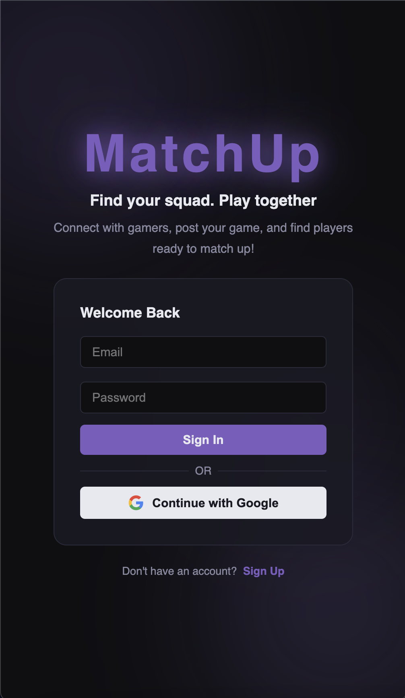
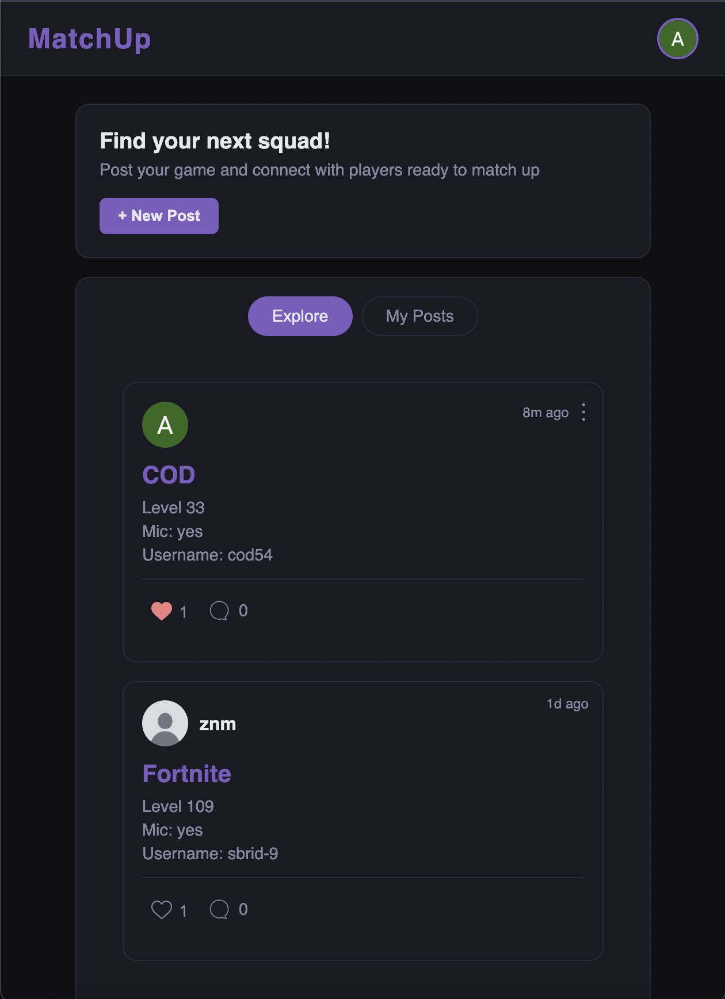
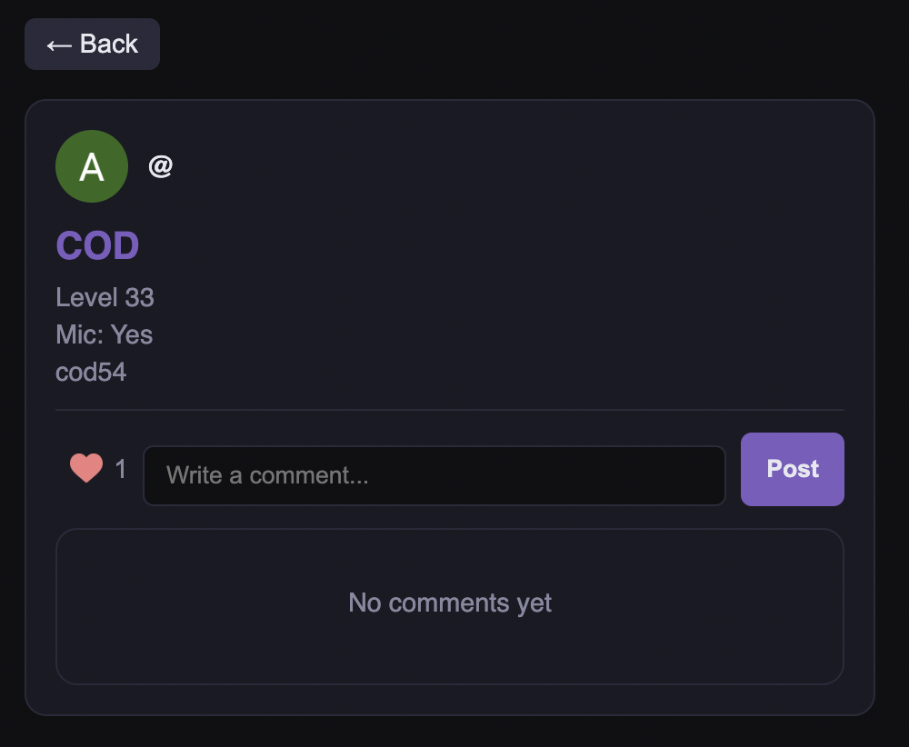
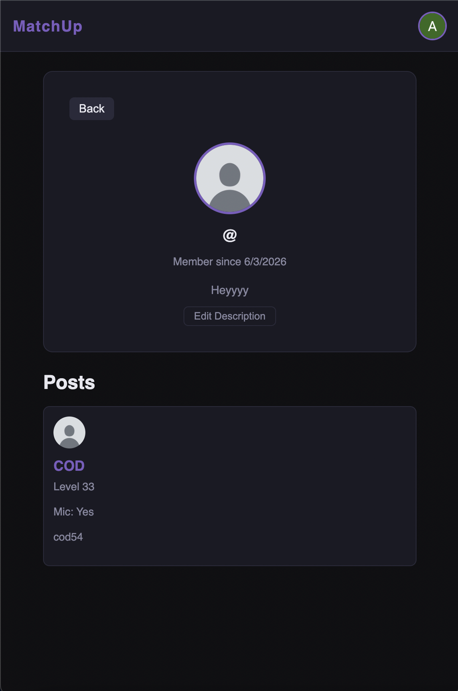

# MatchUp

A real-time social platform for gamers to find teammates, post LFG (Looking for Group) requests, and connect with players across any game.

**Live Demo:** [https://matchup-gaming.vercel.app/profile/OovFb2zLKSeQBPa7XkYMGjieRm33]

---

## Screenshots

### Login


### Feed


### Post & Comments


### Profile


---

## Tech Stack

- **Frontend:** React, React Router, CSS
- **Backend:** Firebase Firestore (real-time database)
- **Authentication:** Firebase Auth (Google + Email/Password)
- **Deployment:** Vercel

---

## Features

- Authentication with Google or Email/Password
- Create LFG posts with game, rank, mic preference, and in-game username
- Real-time feed — posts update instantly for all users
- Like posts with real-time like count
- Comment on posts — view all comments on a dedicated post page
- User profiles with bio, post history, and join date
- Filter between Explore and My Posts tabs
- Relative timestamps (1m, 2h, 3d)
- Dark gaming theme with purple accent
- Responsive design for mobile and desktop

---

## Running Locally

```bash
git clone https://github.com/aliZnm/matchup
cd matchup
npm install
npm run dev
```

> Note: You'll need to set up your own Firebase project and add your config to `src/firebase.js`

---

## Author

**Abdulrahman Ali** — [LinkedIn](https://www.linkedin.com/in/aalii/) · [GitHub](https://github.com/aliZnm)
